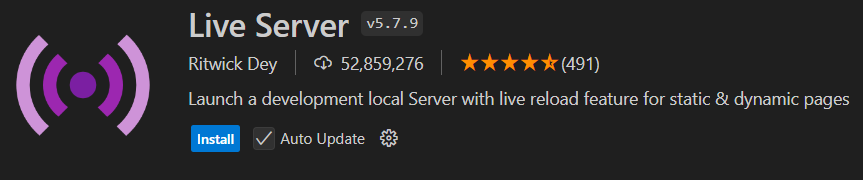
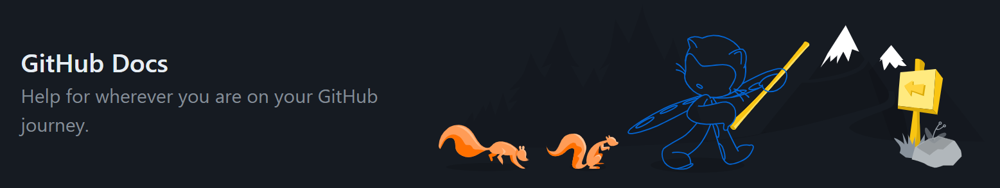

# DR1 TP2 | Programação Web com HTML 5 e CSS 3 [24E3_1]

Repositório para armazenar os projetos desenvolvidos com base nas instruções dadas pelas questões disponibilizadas no moodle.

## 🎟️ Como acessar...
### Através do <a href="https://git-scm.com/" target="_blank">Git Bash Here</a>
 - Crie um diretório temporário onde será clonado o repositório e em seguida acesse esse novo diretório
 ```bash
 mkdir nome-da-pasta
 cd nome-da-pasta
```
 - Realize o seguinte comando para clonar o projeto localmente:
 ```bash
 git clone https://github.com/danielssaugusto/24E3_1_HTML-CSS_DR1_TP2.git daniel_augusto_DR1_TP2
```
## Visualização na WEB

Acesse a IDE VS Code em sua máquina e no campo de extensões `(Crtl + Shift + X)`, procure por "Live Server" publicado por Ritwick Dey.



Após instalado, clique com o botão direito dentro do arquivo HTML e então selecione a opção "Abrir com Live Server".
Isso permitirá acessar um servidor local em uma nova aba do seu navegador padrão.

## Arquivo principal
O arquivo nomeado como `menu.html` contém uma página Web que permite navegar entre as questões.

## 📚 Documentação
 - [Documentação Git](https://docs.github.com/en/get-started/using-git/about-git)
 - [Documentação GitHub](https://docs.github.com/en/get-started/start-your-journey/about-github-and-git)
 - [Documentação Live Server](https://marketplace.visualstudio.com/items?itemName=ritwickdey.LiveServer)

 
